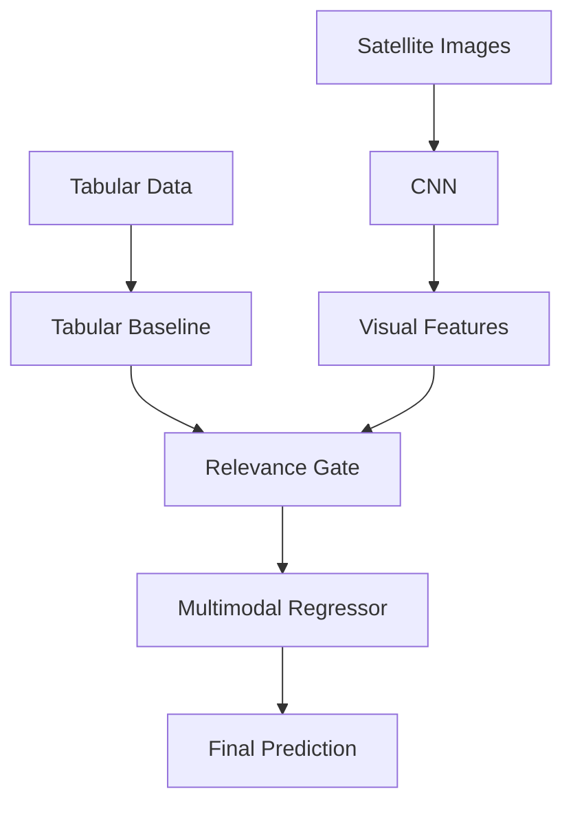

# Multimodal Property Valuation

This project implements a multimodal regression pipeline that combines structured tabular housing data with satellite imagery to improve property price prediction. The workflow includes dataset preprocessing, satellite image acquisition, CNN-based feature extraction, multimodal model training, and Grad-CAM explainability.

---

## 1. Satellite Image Acquisition

Run the following script to download ESRI satellite images using latitude and longitude from the dataset:

python data_fetcher.py

This script will:
- Load train.xlsx from the data/ directory
- Convert coordinates into ESRI tile indices
- Download satellite tiles
- Save images to data/images_v2/ using property IDs as filenames

Ensure that data/train.xlsx exists before running the script.

---

## 2. Tabular Preprocessing

Run this notebook:

preprocessing(Tabular_baseline).ipynb

It performs:
- Data exploration
- XGBoost baseline model training
- Cross-validation
- Saving processed features to data/processed/tabular_features.csv

---

## 3. CNN Feature Extraction

Run:

preprocessing(CNN_feature_extraction).ipynb

This notebook:
- Loads satellite images
- Extracts EfficientNet-B0 visual embeddings
- Computes statistical summaries (mean, std, min, max)
- Computes semantic greenery/water/built-up features
- Saves outputs to data/processed/visual_features.csv

---

## 4. Multimodal Model Training

Run:

model_training(Final_Multimodal_Model).ipynb

This notebook:
- Loads tabular and visual features
- Computes relevance gating values
- Trains an XGBoost multimodal regressor
- Saves the trained model to models/multimodal_xgb.json

---

## 5. Grad-CAM Explainability

Run:

model_training(GradCAM).ipynb

This notebook generates Grad-CAM heatmaps highlighting image regions affecting predictions.

---

## 6. Pipeline Overview

## 7. Performance Summary

| Model | RMSE (log) | R² Score |
|-------|------------|----------|
| Tabular Baseline | 0.163368 | 0.899251 |
| Multimodal (Relevance-Gated) | 0.162990 | 0.899717 |

Performance improvements occur mainly for properties with rich greenery, water proximity, and structured suburban layouts.

---

## 8. Requirements

- Python 3.10  
- XGBoost  
- PyTorch (EfficientNet-B0)  
- NumPy  
- Pandas  
- Pillow  
- OpenCV  
- Matplotlib  

---

## 9. Notes

- Ensure data/train.xlsx is present before running image acquisition.
- All notebooks can be executed locally or in Google Colab.
